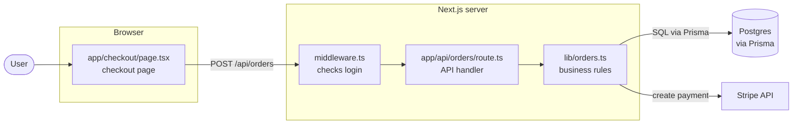
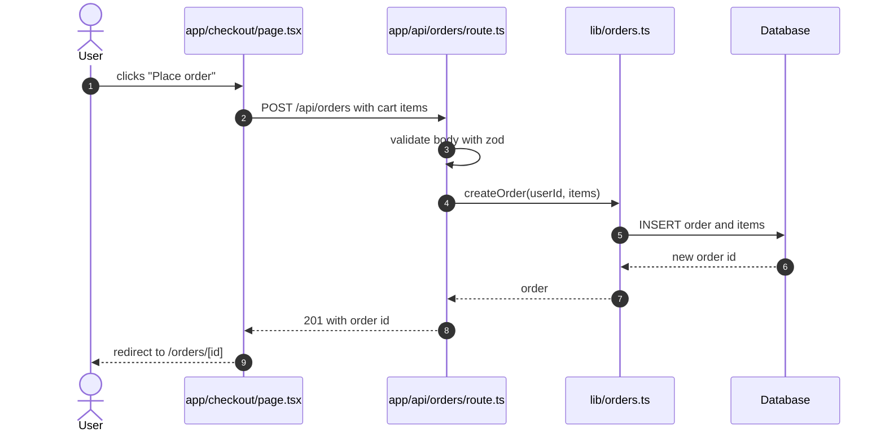
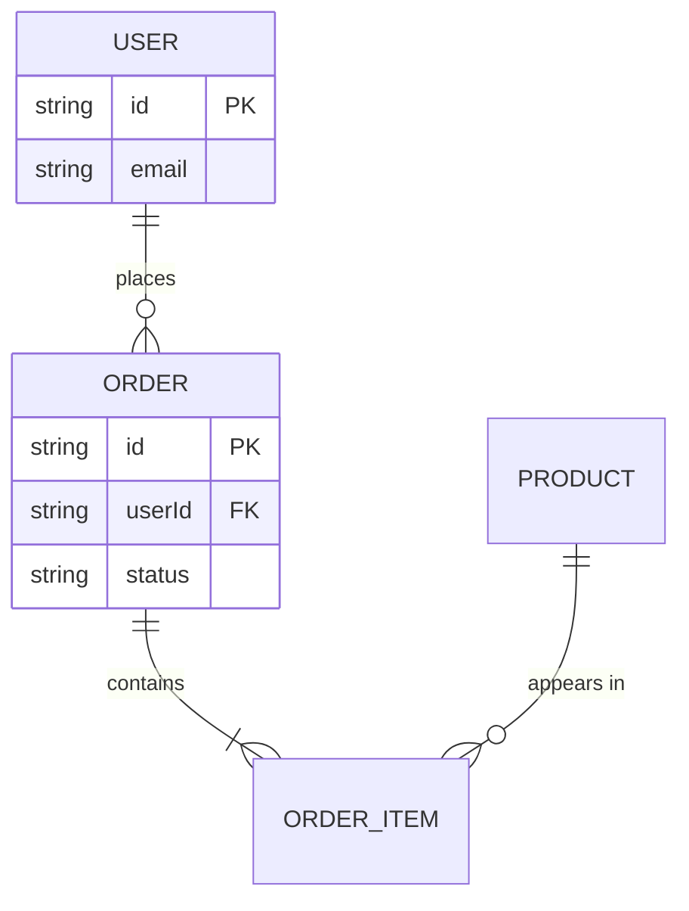
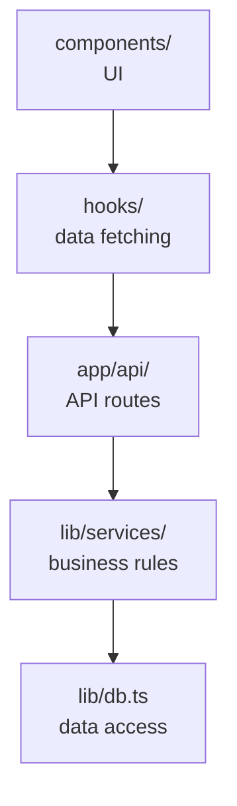
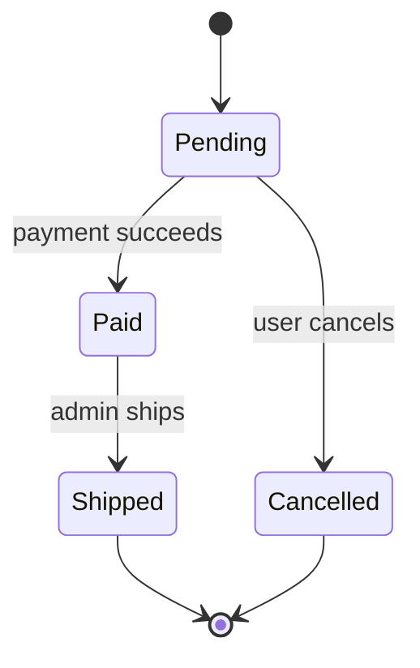
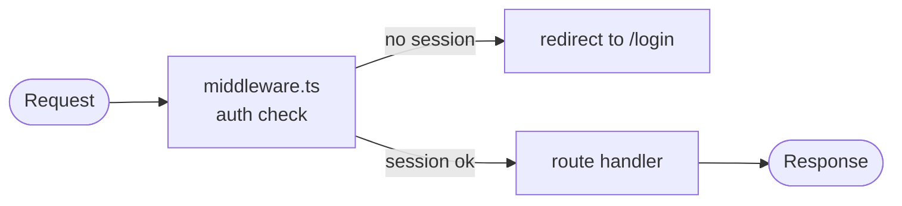

# Diagram cookbook

Mermaid templates for teaching a codebase, and the syntax pitfalls that stop a diagram from rendering.

## Contents

1. Principles
2. Architecture (flowchart)
3. Golden path (sequence diagram)
4. Data model (ER diagram)
5. Layers and dependency direction
6. Lifecycle (state diagram)
7. Request pipeline
8. Folder map (text tree)
9. Syntax pitfalls

## 1. Principles

- **One idea per diagram.** If a caption needs "and also", split it.
- **At most about 15 nodes.** Bigger systems get an overview plus zoom-ins.
- **Label boxes with real names** (`app/api/orders/route.ts`, not "API layer") so every box maps to something the learner can open. A short role on a second line helps: `"lib/orders.ts<br/>business rules"`.
- **Label arrows with what flows**: an HTTP call, a SQL query, an event, a redirect.
- **Caption every diagram** with a "How to read this" line or two: arrow direction, what the shapes mean.

## 2. Architecture (flowchart)



Shapes: `(["…"])` person or start, `["…"]` code, `[("…")]` database, `{"…"}` decision.

## 3. Golden path (sequence diagram)

`autonumber` numbers the arrows so the numbered steps under the diagram line up with them.



Solid arrows (`->>`) are calls; dashed arrows (`-->>`) are responses.

## 4. Data model (ER diagram)



Read the crow's feet aloud in the caption: `||--o{` is "one to zero-or-many", `||--|{` is "one to one-or-many".

## 5. Layers and dependency direction



Caption: arrows point at what each layer depends on, and nothing points back up.

## 6. Lifecycle (state diagram)

Use when an entity has a status field that changes over time.



## 7. Request pipeline

Use when the framework runs several steps before the handler (middleware, guards, validation).



## 8. Folder map (text tree)

Mermaid mindmaps are indentation-sensitive and render deep trees poorly, so use a plain tree in a `text` block with a role per line:

```text
my-app/
├── app/                ← pages and API routes (folder path = URL)
│   ├── api/orders/     ← POST /api/orders lands here
│   └── checkout/       ← the /checkout page
├── components/         ← reusable UI pieces, no data access
├── lib/                ← business rules and the database client
├── prisma/             ← database schema and migrations
└── middleware.ts       ← runs before every request; checks login
```

## 9. Syntax pitfalls

Check each diagram against this list before saving.

**Flowcharts**

- Quote any label containing `( ) [ ] { } < > / : ; # |` or quotes: `api["app/api/[id]/route.ts"]`.
- Inside a quoted label, write a double quote as `#quot;` and a line break as `<br/>`.
- Keep node ids plain words (`api`, `orders`) and put display text in the label.
- `end` as a node id breaks the diagram; use `finish` or `done`.
- Put spaces around arrows. `A---oB` is read as a circle-ended edge to `B`; `A --- ops` is not.
- Give a subgraph a display name with `subgraph server["Next.js server"]`, and close it with `end`.

**Sequence diagrams**

- Alias long participant names: `participant R as app/api/orders/route.ts`.
- A `;` in message text ends the message; write `#59;` instead.
- Don't name a participant `end`.

**ER diagrams**

- Entity names have no spaces (`ORDER_ITEM`).
- Attribute lines are `type name`, optionally followed by `PK`, `FK`, or `UK`; the type is a single word (`string`, `int`, `datetime`).
- Every relationship needs a label after the colon; quote labels with spaces.

**State diagrams**

- States with spaces: `state "Awaiting payment" as Awaiting`, then use `Awaiting`.

If the viewer shows a diagram as an error box, fix that block in the Markdown and rebuild the viewer.
