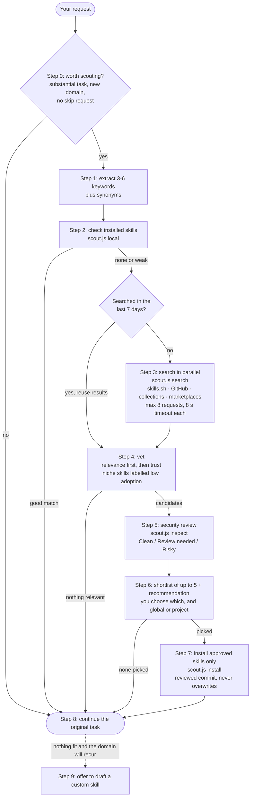

# Skill Scout

A Claude Code plugin that checks for existing agent skills before you start a substantial task, in any domain.

When a task starts, Skill Scout:

1. Pulls search keywords from your request.
2. Checks the skills you already have installed.
3. Searches the open skills directory (skills.sh), GitHub, well-known collections, and the plugin marketplaces you've added.
4. Reviews each candidate's files for security risks.
5. Shows you a shortlist of up to 5.
6. Installs only the ones you pick.
7. Carries on with your original request, so you don't have to type it again.

## How it works



What the shortlist looks like (the names here are made up):

| # | Skill | What it does | Source | Popularity | Updated | Security |
|---|---|---|---|---|---|---|
| 1 | bigquery-loader | Schema mapping, partitioned loads, MERGE upserts | acme/data-skills | 12K installs | 2026-09 | Clean |
| 2 | shopify-admin-api | Pagination, rate limits, order export | jdoe/shopify-skills | 840 installs | 2026-07 | Review needed: calls the Shopify API |
| 3 | etl-scheduling | Cron vs Airflow vs Cloud Scheduler | someone/etl-kit | low adoption (35 installs) | 2026-05 | Clean |

## When it triggers

Claude invokes the skill on its own at the start of substantial build, research, R&D, analysis, or design work. This is most likely in a specialized domain: a specific platform, language, framework, file format, protocol, or industry. Examples:

- "build an integration for Shopify"
- "do R&D on a new caching layer"
- "set up a data pipeline"
- "design a mobile app"

It also runs when you ask "is there a skill for X", "find skills for this", or "what skills could help here". You can always run it yourself with `/skill-scout:skill-scout <task>`.

It stays quiet for:

- small edits, quick questions, and one-line fixes
- follow-up steps inside a task that's already underway
- domains it already searched in the current session
- any request where you say **"skip skill search"**

## Requirements

- **Node.js 18 or newer** on Windows, macOS, or Linux. There are no npm dependencies.
- **Optional:** the GitHub CLI, logged in with `gh auth login`. Without it, GitHub's code search isn't available, so Skill Scout searches repositories instead and is limited to 60 GitHub API requests an hour.
- **Optional:** a cached `skills` CLI (`npx skills`). It's used only if the skills.sh API is unreachable, and it's never downloaded automatically.

If a source is unavailable, it's skipped with a one-line note and the task carries on.

## Install

1. Copy the `skill-scout/` folder into your marketplace repository, for example as `plugins/skill-scout`.
2. Add this entry to the `plugins` array in `.claude-plugin/marketplace.json`:

   ```json
   {
     "name": "skill-scout",
     "source": "./plugins/skill-scout",
     "description": "Finds, vets, and installs agent skills that fit your task, with a security review and your approval before anything is installed.",
     "category": "productivity",
     "tags": ["skills", "discovery", "security"]
   }
   ```

3. Validate both, then push:

   ```bash
   claude plugin validate ./plugins/skill-scout
   claude plugin validate .
   ```

4. Install it:

   ```bash
   # first time only: register the marketplace
   claude plugin marketplace add <owner>/<marketplace-repo>
   # if it's already registered: pick up the new entry
   claude plugin marketplace update <marketplace-name>

   claude plugin install skill-scout@<marketplace-name>
   ```

   Inside a session, `/plugin marketplace add …` and `/plugin install skill-scout@<marketplace-name>` do the same. Then run `/reload-plugins` or start a new session.

`plugin.json` sets a `version`, so users stay on that version until you bump it.

## Disable or remove

| Goal | How |
|---|---|
| Skip it for one request | Include "skip skill search" in the request |
| Turn it off but keep it installed | `claude plugin disable skill-scout@<marketplace-name>` (turn it back on with `claude plugin enable …`) |
| Stop Claude from invoking it | Add `Skill(skill-scout:skill-scout)` as a deny rule in `/permissions` |
| Remove it | `claude plugin uninstall skill-scout@<marketplace-name>`. This also deletes its search cache |

**If you also have `find-skills`:** that skill covers the same "find a skill for X" requests and installs with `-g -y`, which skips confirmation. To stop the two competing, turn it off in `~/.claude/settings.json`:

```json
{ "skillOverrides": { "find-skills": "off" } }
```

## Security

**Network access is read-only:**

- Skill Scout contacts `skills.sh`, `api.github.com`, and `raw.githubusercontent.com`.
- It never reads tokens itself. When `gh` is logged in, it calls `gh api`, which uses your own login.

**Every candidate is reviewed before it's recommended:**

- `inspect` pins the commit, lists every file, and scans scripts and instructions for risky patterns: network calls, reading credentials or env vars, elevated shell commands, downloading more code, permission bypasses, hidden instructions, and opaque binaries.
- Claude then reads the SKILL.md itself, treating it as untrusted data, and rates the candidate Clean, Review needed, or Risky.
- The full checklist is in `skills/skill-scout/references/security.md`.

**Nothing is installed without your approval:**

- You pick skills in chat, and Claude Code asks permission again before running the install command.
- No confirmation-skipping flags are used.
- Only `local`, `search`, and `inspect` are pre-approved, because they are read-only.

**What gets installed is exactly what was reviewed:**

- The installer downloads the full commit SHA that `inspect` printed.
- It never overwrites an existing folder.
- It skips symlinks and submodules, and refuses paths that escape the target folder.
- It caps an install at 300 files and 20 MB.
- It writes to a staging folder first.
- It records where the skill came from in `.skill-scout.json`.

**Limits:** pattern scanning is a first filter, not a guarantee. A Clean rating means nothing suspicious was found; it doesn't prove the skill is safe. Read the code of any skill rated Review needed or Risky before approving it.

**Local writes:** besides installed skills, the only file written is the search cache, in the plugin's data folder. It's removed when you uninstall the plugin.

## Files

```
skill-scout/
├── .claude-plugin/plugin.json
├── README.md
└── skills/skill-scout/
    ├── SKILL.md                    workflow Claude follows
    ├── references/
    │   ├── sources.md              sources, fallbacks, rate limits, cache
    │   ├── vetting.md              ranking and trust signals
    │   └── security.md             security checklist and ratings
    └── scripts/
        ├── scout.js                CLI: local | search | inspect | install
        └── lib/                    http, match, local, remote, inspect, install, cache
```

You can run the scripts directly, without Claude Code:

```bash
node skills/skill-scout/scripts/scout.js search "react native" expo --data ./tmp-cache
node skills/skill-scout/scripts/scout.js inspect expo/skills --path plugins/expo/skills/eas-hosting
```
